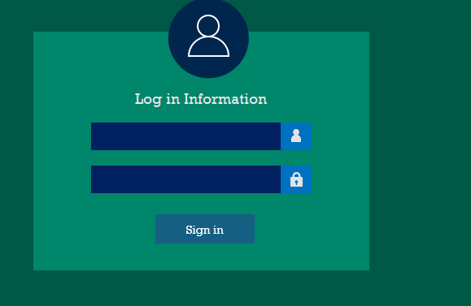
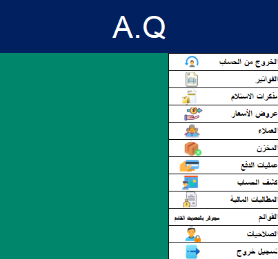

# Excel Accounting System

This is a fully integrated accounting system built using Microsoft Excel and VBA macros. The file simulates a desktop application with a secure login screen, navigation menus, and functional modules for managing core accounting operations.

## 💡 Features

- 🔐 **User Login & Authentication**
- 🧾 **Sales Module**
- 💼 **Quotations Generator**
- 🧮 **Invoice Management**
- 👥 **Clients & Account Statements**
- 📦 **Inventory Tracking**
- 📊 Custom Excel dashboards & reports

## 📂 File Structure

-## 🖼️ معاينة الصور

### شاشة تسجيل الدخول:

### الواجهة الرئيسية:

## 📥 تحميل الملف

يمكنك تحميل الملف من هنا:

📎 [تحميل ملف Excel المحاسبي](Full-Accounting-Software.xlsm)

## 🚀 How to Use

1. Open the `.xlsm` file in Microsoft Excel (2016 or later).
2. Enable **macros** when prompted.
3. Log in using the default credentials:
   - **Username**: `admin`
   - **Password**: `admin` (you can change this later)
4. Use the buttons in the main interface to navigate through the system.

## 🛠 Requirements

- Microsoft Excel 2016 or later
- Macros must be enabled
- Windows OS is recommended for full VBA compatibility

## 🔐 Security Note

This file uses simple VBA for demonstration purposes. For production or sensitive data, consider implementing advanced encryption and secure database integration.

## 📃 License

This project is shared for educational purposes only. Not intended for commercial use without permission.

---

Feel free to fork, enhance, or adapt it for your own business logic or client needs!
